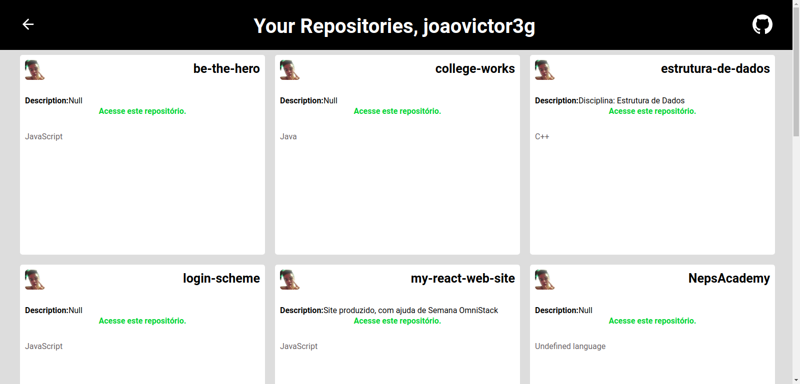

# See your respositories on GitHub in an easy peasy way.

- Login screen:

- Logged screen:

### Project
A easier way to see repositories on GitHub and navigate to them.

### How to contribute?
- Fork this repository;
- Create a branch with your feature: `git checkout -b my-feature`
- Commit changes: `git commit -m 'feat: My new feature'`
- Push branch: `git push origin my-feature`

### Running
- This application is running on [My app](https://github-repo-list-frontend.herokuapp.com/), hosted in [Heroku](https://www.heroku.com/)

### License 
MIT license. See license on [LICENSE](LICENSE)
