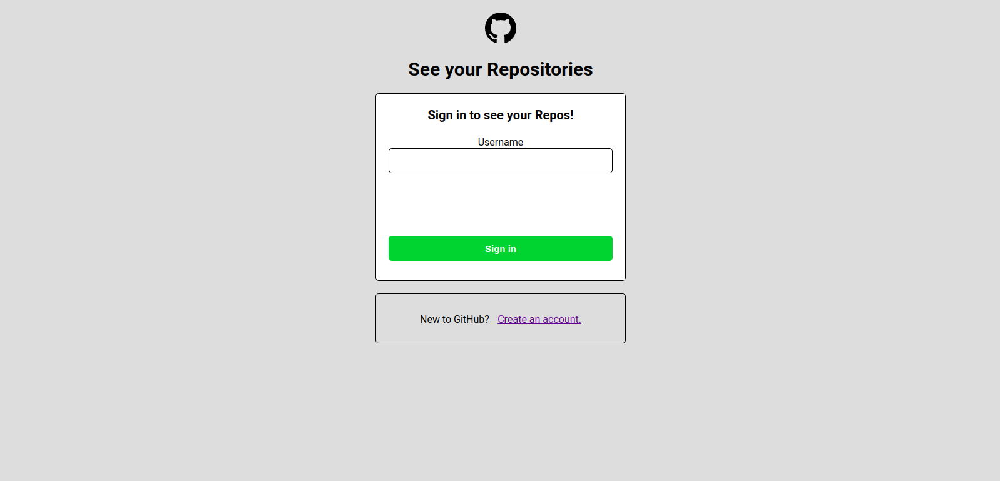
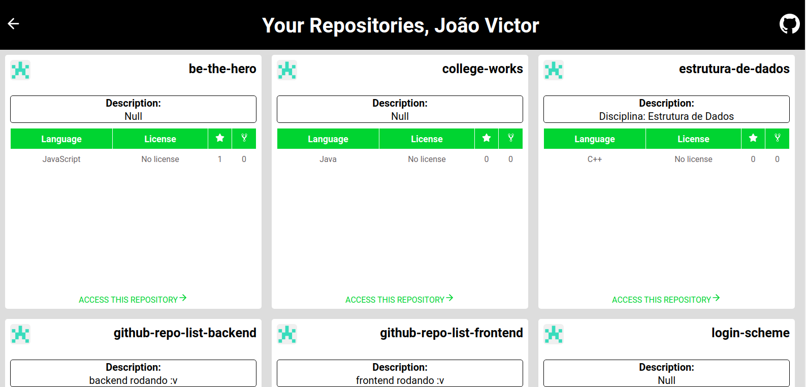

# See your respositories on GitHub in an easy peasy way.

- Login screen:

- Logged screen:

### Project
Another way to see your repositories on GitHub and navigate to them, using public API from GitHub. 

### How to run?
- Clone this repository.
- Go to cd backend and `npm install`, to install the dependencies and `npm run dev` to start.
- Go to cd frontend and `npm install` and `npm start` to start.
- There is a limit on requests to the GitHub public API, which is 60 per hour, so if you are going to test be careful. :v   

### How to contribute?
- Fork this repository;
- Create a branch with your feature: `git checkout -b my-feature`
- Commit changes: `git commit -m 'feat: My new feature'`
- Push branch: `git push origin my-feature`

### License 
MIT license. See license on [LICENSE](LICENSE)
